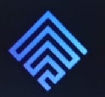

 
Dayli 27/3/2024:
---
## Integrantes presentes:
* Emmanuel Heredia
* Angel Moreno
* Valeria Castillo
-------
Posterior a la clase de Habilidades blandas, realizamos una reunión por zoom para redistribuir las tareas del sprint 7.
Se armó una ruleta y el azar decidió nuestras tareas, iniciamos el tablero y en ella se coloco la distribución y el puntaje correspondiende.
Se envió un mensaje al cuarto integrante que no se encontraba, notificandole sus tareas, se envió mensaje para que se uniera (sin respuesta).
Luego habiendo distribuido las tereas nos quedamos refactorizando en conjunto nuestras APIS.

weekly 1/4/2024:
---
## Integrantes presentes:
* Emmanuel Heredia
* Angel Moreno
* Valeria Castillo
-------
Siendo las 11:00 am, nos reunimos a intergrar las ramas y coordinar arreglos que queremos hacer a nivel proyecto y modificar conflictos surgidos por la itegración , también al tener métodos diferentes de trabajar se integraron ideas de código de otros integrantes en las distinta vistas para que quede más  unificado y completo, con análisis  y explicación  mediante  además  de compartir ideas que nos sirven para enriquecer nuestro aprendizaje.

#### Arreglos a implementar:

*Dialogamos sobre como vamos a refactorizar dashboards.
*Unificar los background de todas las vista para que quede mas unificada la página y no se vea incogruente.
*Implementación  search.
*Se conversó sobre la ausencia del cuarto integrante se intentó comunicación via whatsapp y no obtuvimos respuesta, propusimos volver a intentar y sino realizar una reunión en clases pidiendo tiempo con profesores.
*coordinamos otra reunion mas tarde para probar y cambiar detalles en nuestras APIS.

--finalización:14:18